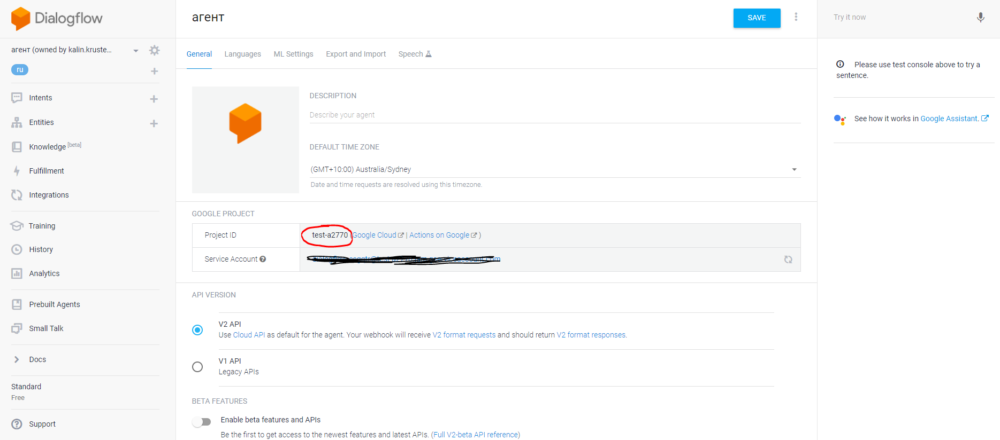
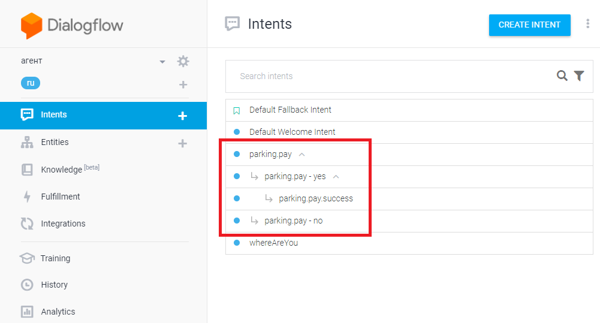
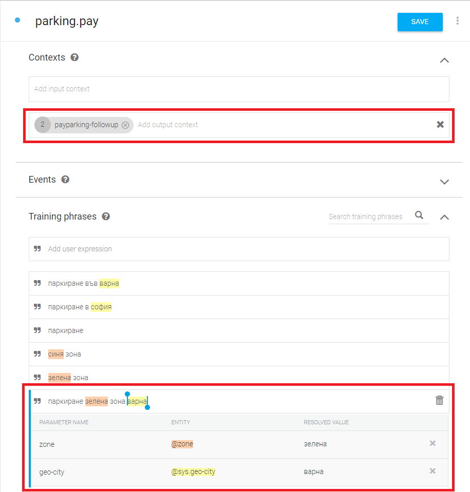
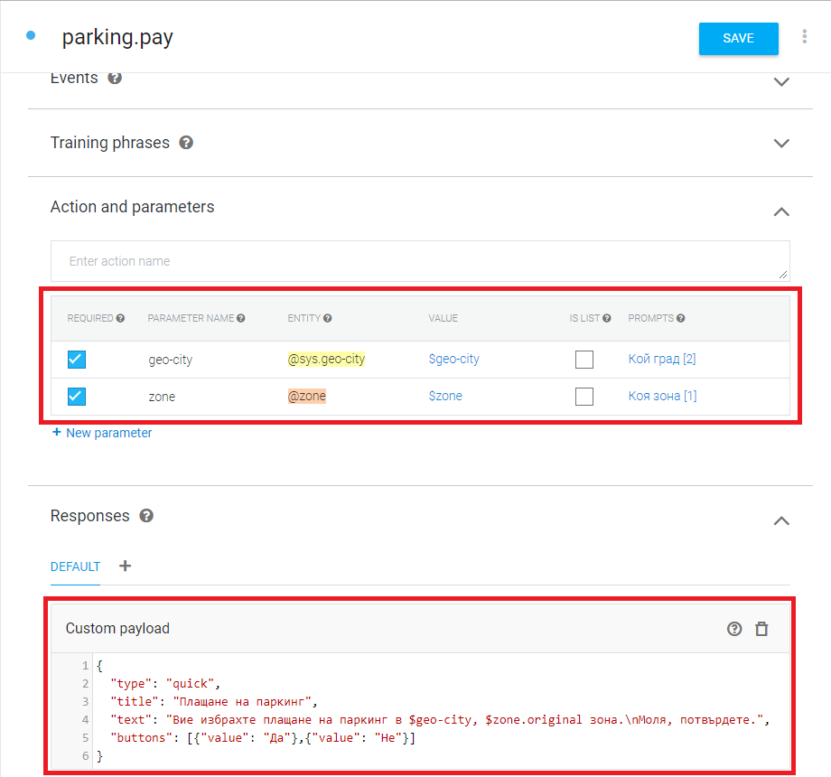
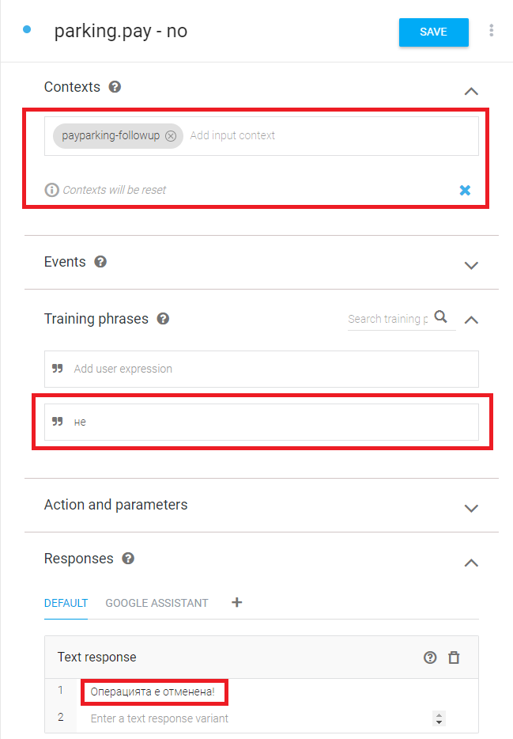
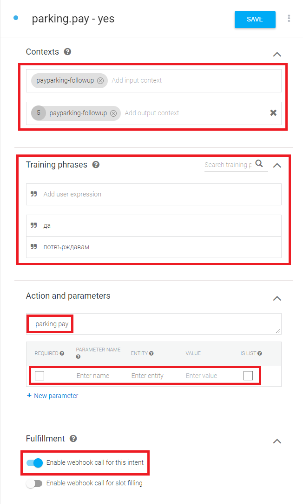
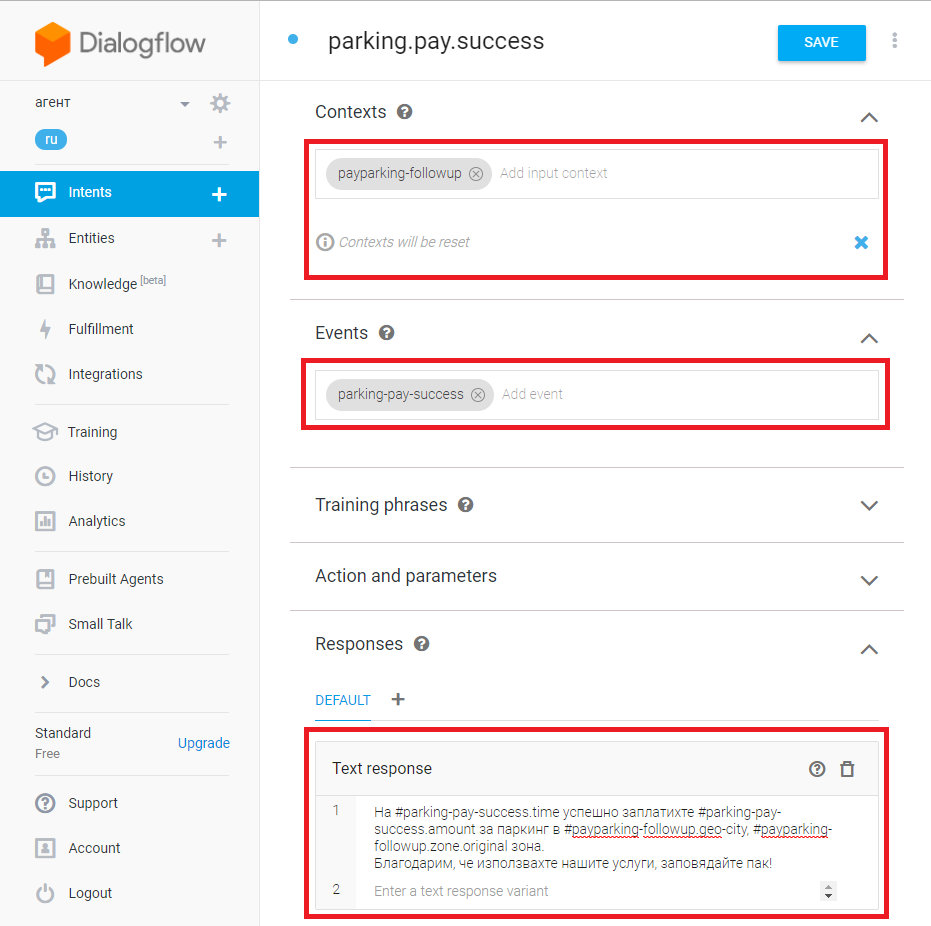
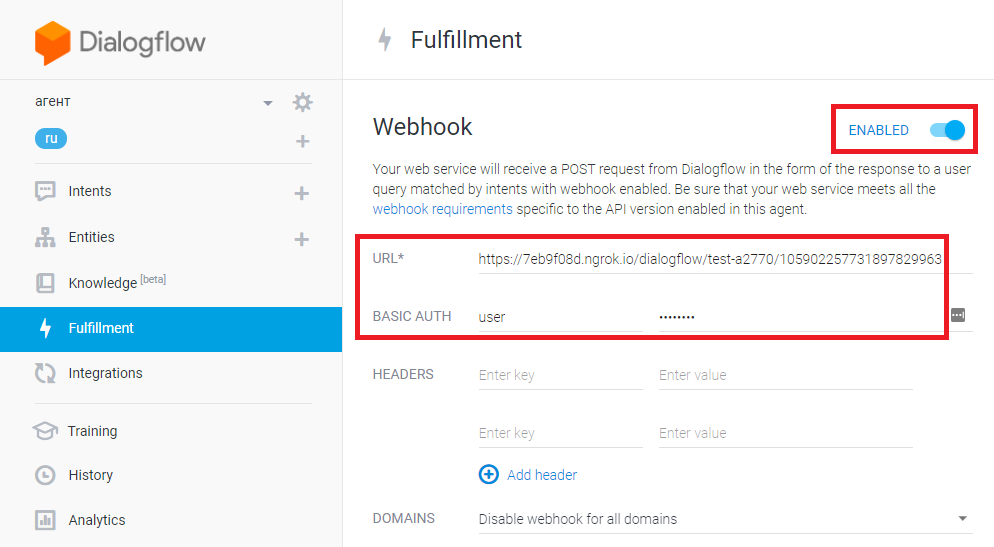

# ut-port-dialogflow

## Configuration parameters

Use the screenshots below to define the following parameters:

* `project` - use `project_id`, highlighted in the screenshot
* `name` - user defined (unique nlp agent name)
* `auth` - Private key in JSON format.

The configuration path is `utNlp.dialogflow.standard.agents`
If you need to configura multiple agents via configuration
just provide an array of objects containing the properties
described above.

Use [this](https://dialogflow.com/docs/reference/v2-auth-setup) guide
to see how to create a Service Account and obtain a private key.

## Training a dialog, that invokes backend action

This section provides information on how to create a simple
dialog, that can invoke action at the server. It is based
on example use case of paying for parking.

### Create main intent and follow ups

The dialog consists of main intent and 3 follow-ups:

* `parking.pay` - this is the main intent, it is recommended
  to be named after a back-end method.
* `parking.pay - no` - this is a follow up intent, which is
  triggered when cancels the operation.
* `parking.pay - yes` - this is a follow up intent, which is
  triggered when confirms the operation. This intent invokes
  the back-end method.
* `parking.pay.success` - this is a follow up intent, which is
  triggered when the back-end confirms that the operation is
  completed successfully.

Fow consistency, it is good to follow this or similar naming
convention for all dialogs, that involve back-end acitons.
Here is how these intents should look like in the list of
intents:

### Main intent training phrases

The main intent should be trained with phrases that
relate it. Also as part of defining the follow-up intents,
the main intent should have output context, which will be
used for passing information to the follow-ups.

### Main intent parameters and response

If the intent involves any parameters,
they should be filled in. For our parking example the
parameters are `geo-city` and `zone`. Finally a response
should be configured. This response will be returned
when the intent has all the parameters collected from
the user. This response usually asks the user to confirm
the intent if it involves some important action.  The example
below, shows how a response with `yes` / `no` buttons can be
configured:

### `No` follow-up

The `no` follow up must be trained with phrases that the
user can enter to cancel the operation. Usually it is a
good idea to clear the contexts, see `Contexts will be reset`
in the example below. Finally there should be also some text
response to the user that the operation was cancelled.

### `Yes` follow-up

The `yes` follow up must be trained with phrases that the
user can enter to confirm the operation. This follow up
usually should pass the input context as output context,
so that parameters can be accessed at the back-end.
For `Action and parameters` section:

* In the `action` field, put the action to be invoked at the
  back-end, it is `parking.pay` in our example.
* In the `parameters` table, additional parameters can be
  defined and they will be passed together with the context
  parameters to the back-end.

Finally, make sure `Enable webhook call for this intent` is
turned on. This screenshot shows an example for all the above:

### `Success` follow-up

This follow-up is triggered by successful completion of the
operation by the back end. For this to happen, the `events`
field must contain the value derived from the `action` field
from the `yes` intent by changing dots to minus sign and adding
suffix `-success`. The success follow-up usually contains
some message to the user, that gives summary of the operation
outcome. It will often reference values from both the `yes`
intent context and also values coming from the back-end, which
are available in the event. In our example, context values
are available by using the notation
`#payparking-followup.XXX`, while back-end values by
using the `#parking-pay-success.XXX` notation, as shown on
the following screenshot:

### `Fulfillment` webhook

For intents to be able to invoke back-end, make
sure you fill the required info in the `Fulfillment`
section, as shown below:

